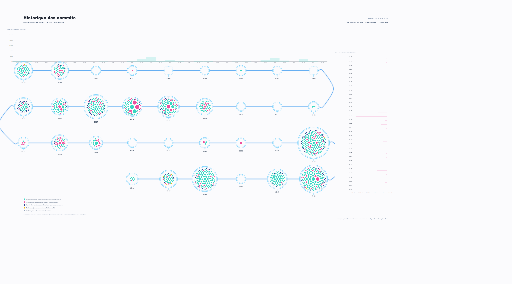

# Sera

Sera is a framework that combines three tools into one ecosystem, providing cross-tool features such as native CPU/GPU optimizations, memory allocation management, chunking systems, alias management, and more.

The main goal of Sera is to be developed entirely in pure Rust, avoiding dependencies on external tools by providing a complete and self-contained ecosystem. The framework is designed with a more development-oriented approach, relying less on long method chains or complex callable patterns.

Sera gives developers full freedom to build the way they want: create custom configurations, define their own aliases, extend the framework, and adapt it to their own workflows.

The objective is also to be significantly faster and lighter than existing solutions. Since I am currently developing this project alone and not working on it full-time, I cannot yet provide tools as complete and mature as libraries such as **scikit-learn**, **pandas**, or **matplotlib** in such a short amount of time. However, the long-term goal is to progressively reach similar levels of functionality while maintaining Rust's performance, safety, and efficiency.

Sera was initially created to address my own needs, but it also aims to bring data visualization, machine learning, and dataframe manipulation capabilities to programming languages other than Python. One of the long-term goals is to make Sera available across multiple languages, especially through integrations such as **C#** bindings.

Feel free to open issues, suggest improvements, or discuss the architecture. You can also explore how the code is structured to create your own plots, themes, variants, and extensions.

The ecosystem is designed to remain clean, modular, and easy to contribute to. Contributions are more than welcome!

## Components

Sera is composed of three main tools:

- **SeraPlot** — Data visualization and graph generation.
- **SeraML** — Machine learning tools and algorithms.
- **SeraDFrame** — Dataframe manipulation, analysis, and tabular data processing.

Each component is designed to work independently while also benefiting from shared features provided by the Sera ecosystem.

You are free to explore the source code and contribute to the project.

## Development

More than **90% of the codebase has been written manually**.  
The documentation, however, was greatly assisted by Claude in order to provide a complete and accessible documentation as quickly as possible.

Documentation:
https://feur25.github.io/Sera/introduction.html

## Commit History

Every commit, packed by week, sized by lines changed, colored by insertions vs. deletions — built entirely with SeraPlot's own canvas and bar chart primitives. Refreshed automatically every Monday.

Click the image for the live, hoverable version — hover a commit for its details, or an author's mark to rescale the margins to their own activity.